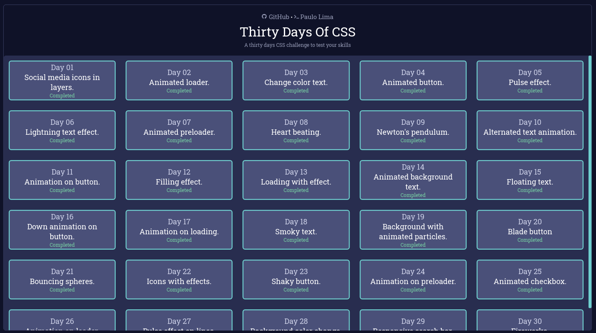

# 🖥️ Thirty Days Of CSS

<h1 align="center">
  
</h1>

## 🔎️ Description

Thirty days of CSS is a challenge that aims to help you improve your coding skills by doing mini daily projects using HTML5 and CSS3. In my case, I have decied to create a React.js application to serve as a base to all the challanges.

## 👀️ Rules

- Finish one challenge a day.
- Share your progress on social media (Twitter, Facebook, Linkedin etc.) using the hashtag #30DaysOfCSS

## ✨️ See live

If you want to take a look at the challenges and also at my solutions checkout <a href="https://paulophlp.github.io/portfolio/">this link</a>.

## 🔥️ Face this challenge

If you also want to face this challenge take a look at **<a href="https://github.com/PauloPHLP/React.js-ThirtyDaysOfCSSTemplate">this repository</a>**. This repository contains a copy of this project and you can use it as a template to solve everything by yourself. All the instructions are available there, so fell free to take a look on it!

## 🚀️ Technologies

- HTML5
- CSS3
- React.js
- TypeScript
- Yarn

---

I was inspired by **<a href="https://github.com/MilenaCarecho/30diasDeCSS" target="__blank">Milena Carecho</a>** to face this challenge. Check out her work!

Thank you and good coding 😎️

Made by **<a href="https://paulophlp.github.io/portfolio/" target="__blank">Paulo Lima 🤓️</a>**
